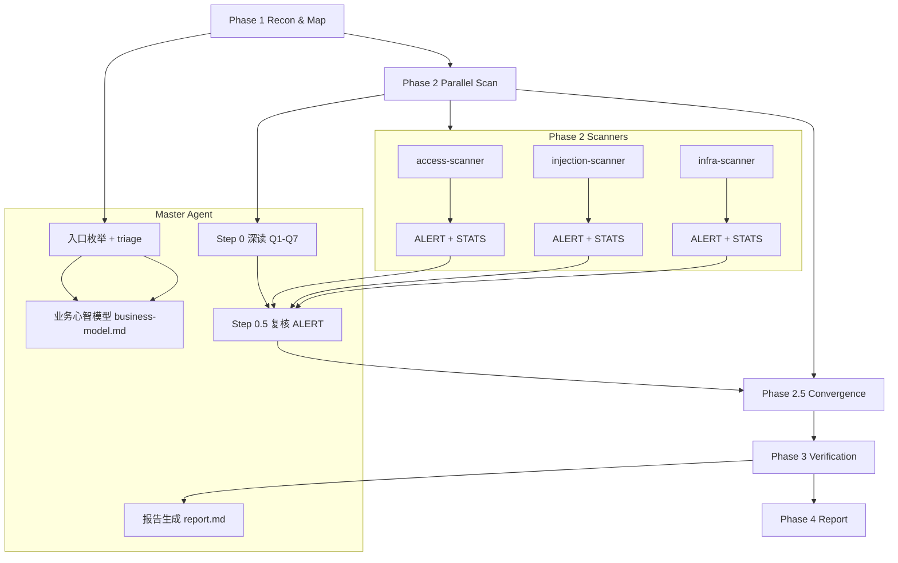
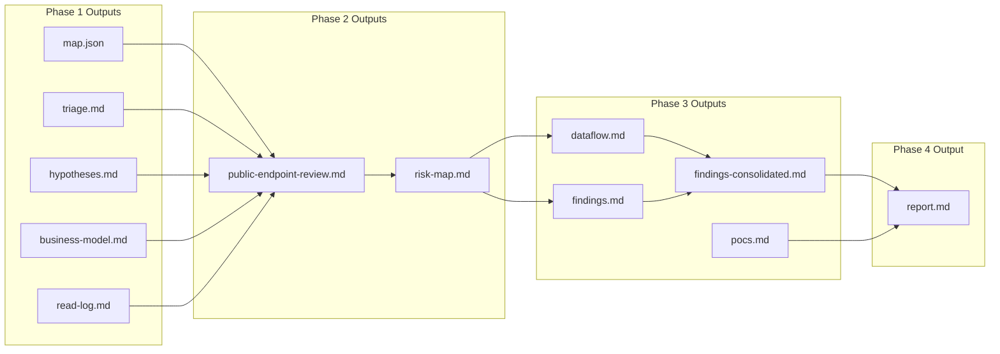

# Code Security Audit Skills

## 概览
该仓库包含 `code-security-audit` 审计流程的 **skills** 与 **droids**。核心目标是以 Q1–Q7 语义审计为中心，完成 Phase 1–4 的端到端安全评估，并默认输出全中文、复现导向报告。

## 目录结构
- `skills/`：主流程与 playbooks
- `droids/`：Phase 2/3 子代理

## 流程概述
1. **Phase 1**：建图与 triage（含 Phase 1.8 业务心智模型）
2. **Phase 2**：并行扫描（ALERT + STATS 两级输出）
3. **Phase 2.5**：收敛检查
4. **Phase 3**：深度验证与证据固化
5. **Phase 4**：中文复现报告（Critical/High 必含 PoC）

## 流程图（Flowchart）

## 产物流转图（Artifacts Flow）

## 关键特性
- **业务心智模型**：输出 `audit/business-model.md`（行为签名 + 敏感数据清单）
- **触发器分级**：L1/L2 必报、L3 聚合采样、L4 统计绑定基线
- **语义复核**：Step 0.5 由 master 复核 ALERT 队列，Q3/Q7 对比基线

## 使用方式
1. 将 `skills/` 与 `droids/` 放入 Factory 对应目录
2. 调用 `code-security-audit` skill
3. 输出位于 `audit/`

## 说明
完整规则与模板请查看 `skills/code-security-audit` 下的 playbooks 与模板文件。
