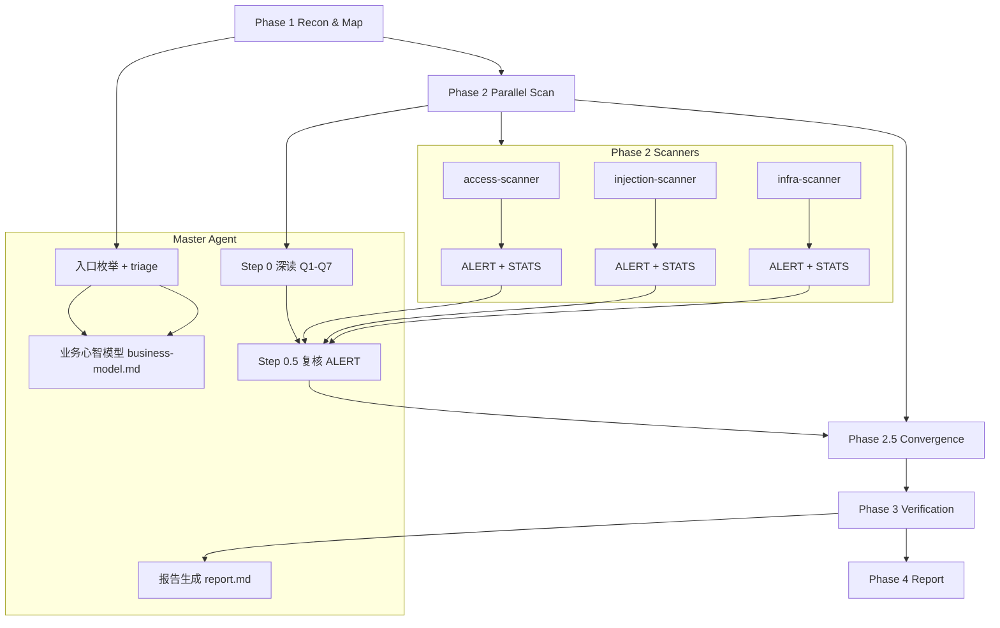
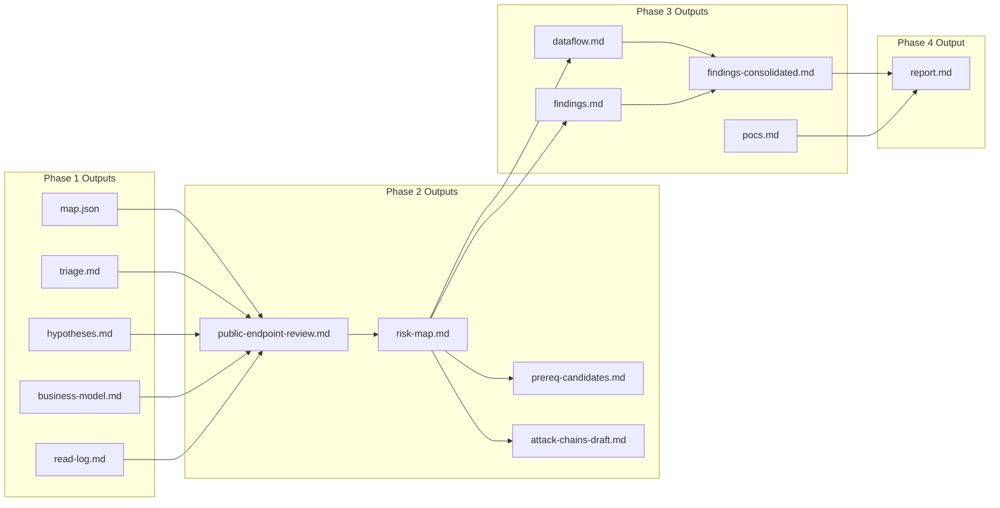

# Code Security Audit Skills

## 概览
该仓库包含 `code-security-audit` 审计流程的 **skills** 与 **droids**。核心目标是以 Q1–Q7 语义审计为中心，完成 Phase 1–4 的端到端安全评估，并默认输出全中文、复现导向报告。

## 目录结构
- `skills/`：主流程与 playbooks
- `droids/`：Phase 2/3 子代理

**子目录说明**：
- `skills/code-security-audit/playbooks/`：Phase 1–4 的执行规程与门槛
- `skills/code-security-audit/output-templates.md`：最终报告与复现模板
- `droids/`：扫描器（Phase 2）与验证器（Phase 3）

## 流程概述
1. **Phase 1**：建图与 triage（含 Phase 1.8 业务心智模型）
2. **Phase 2**：并行扫描（ALERT + STATS 两级输出）
3. **Phase 2.5**：收敛检查
4. **Phase 3**：深度验证与证据固化
5. **Phase 4**：中文复现报告（Critical/High 必含 PoC）

## 流程图（Flowchart）

## 产物流转图（Artifacts Flow）

## 关键特性
- **业务心智模型**：输出 `audit/business-model.md`（行为签名 + 敏感数据清单）
- **触发器分级**：L1/L2 必报、L3 聚合采样、L4 统计绑定基线
- **语义复核**：Step 0.5 由 master 复核 ALERT 队列，Q3/Q7 对比基线
- **LSP 优先导航（Phase 3）**：dataflow/access/validate 三个 Phase 3 droid 优先使用 `go-to-definition` / `find-references` / call hierarchy 精确追链，确保跨函数/跨模块调用关系可靠；LSP 不可用或未安装时，才回退 `rg` 文本检索

**门槛与完整性（核心新增）**：
- **Manifest Coverage Gate（Phase 1）**：`entries/route_files >= 0.95`，低于阈值禁止进入 Phase 2
- **Coverage Hard Gate（Phase 2.5）**：D1/D2/D3/D11/D12 必须 ✅，并新增 E6「模块深读抽样」门槛
- **Attack-Chain Draft（Phase 2.5 前置）**：Phase 2 产出 `attack-chains-draft.md`，Phase 3 按链路优先级验证
- **输出完整性规则**：报告宣称 `N` 个发现必须逐条列出，禁止“同类省略”占位

**Prerequisite 追踪（Phase 2/3）**：
- 发现 P0/P1 时即时记录 `prereq-candidates.md`
- Phase 3 优先验证未满足前置条件的链路段（`resolved=false`）

**LSP 使用约束（Phase 3）**：
- 仅在 Phase 3 深度验证阶段启用（Phase 1/2 仍保持文本/结构检索为主）
- 推荐服务器：
  - TypeScript/JavaScript：`npx typescript-language-server --stdio`
  - Python：`basedpyright-langserver --stdio`（或 `pyright-langserver --stdio`）
- 若 LSP 缺失，按提示征求安装许可，失败或拒绝才使用 `rg` 兜底

## 使用方式
1. 将 `skills/` 与 `droids/` 放入 Factory 对应目录
2. 调用 `code-security-audit` skill
3. 输出位于 `audit/`

## 关键产物清单（按阶段）
### Phase 1
- `map.json`（entries/sinks/models/configs + 控制字段）
- `triage.md`、`hypotheses.md`、`read-log.md`、`business-model.md`

### Phase 2
- `public-endpoint-review.md`、`risk-map.md`
- `prereq-candidates.md`（前置条件追踪）
- `attack-chains-draft.md`（链路草案）

### Phase 3
- `dataflow.md`、`findings.md`、`findings-consolidated.md`

### Phase 4
- `report.md`（全中文渗透复现报告）

## 说明
完整规则与模板请查看 `skills/code-security-audit` 下的 playbooks 与模板文件。

